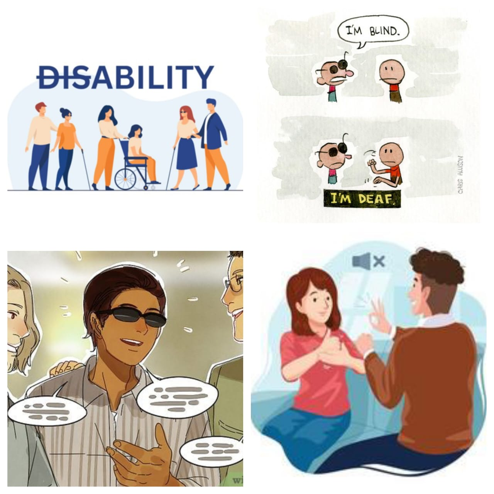

# Deaf-Blind-Communicator
## 🎯 Aim
To **bridge the communication gap between blind and deaf/mute individuals** by enabling real-time, two-way interaction using **speech-to-text** and **text-to-speech** technologies.

---

## 💡 Project Overview
This desktop-based Python application provides a GUI where:

- A **blind user** can speak → their words are converted to text using speech recognition.
- A **deaf/mute user** can type → their message is read aloud using a text-to-speech engine.
- A **webcam** detects a face before speech is recorded, ensuring speech input is intentional.
- A shared conversation box logs the entire communication, making it easy to follow.

---

## 🔍 Features
| Feature                             | Description                                                                 |
|-------------------------------------|-----------------------------------------------------------------------------|
| 🎙️ Speech Recognition               | Blind users speak via mic → converted to text via Google Speech API        |
| ⌨️ Text Input + TTS                 | Deaf/mute users type → system speaks it using `pyttsx3`                    |
| 🧠 Face Detection Trigger           | Face detection (OpenCV) starts listening only when a user is visible       |
| 🪟 Interactive Tkinter GUI         | Smooth and simple interface for both users                                 |
| 🧾 Conversation History             | Full two-way message log within the app                                    |
| 🔄 Reset Button                     | Clears conversation for a fresh start                                      |

---

## 🛠️ Technologies Used

- **Python 3**
- **Tkinter** – GUI
- **SpeechRecognition** – Speech-to-text
- **pyttsx3** – Offline text-to-speech
- **OpenCV (cv2)** – Face detection with webcam
- **PIL (Pillow)** – To display static image (banner)

---
## 📸 Screenshot

> 

---
## ▶️ How to Run

### Step 1:Install dependencies:
```bash
pip install pyttsx3,SpeechRecognition, opencv-python, pillow
Step 2: Run the app

